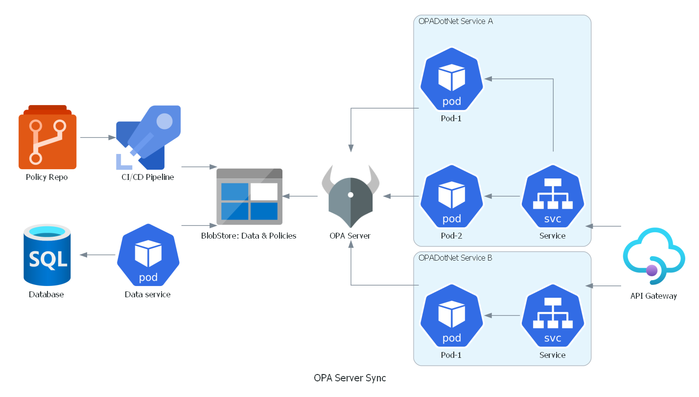

.. _opaserversync:

OPA Server Sync
=================

If you have an existing *OPA server*, that contains central information, then it is easy to connect to that server and fetch the policies and data required for your policies
by adding a sync to the *OPA server*.

To configure a sync against an *OPA server* add the following configuration when adding OPA to the service collection:

.. code-block:: csharp

  services.AddOpa(opt =>
    .AddSync(s =>
        s.UseOpaServer("https://youropaserver")
    )
  );

Reference architecture
------------------------

Having an OPA server as a central store for policies and data allows a single place to contain your microservices policies and data. It also allows to easily switch between externally evaluating policies and
using the embedded mode. For instance external evaluation can be used during development, while embedded mode is used in production for better performance.
This can look as follows:

In the picture above, the central data store is in an *Azure Blob Storage*, where all the policies and data are stored.
The rego policy files comes from a *GIT* repository and gets published using a build pipeline and data gets published by a service that fetches data from a remote database.

*OPA Server* fetches the policy and data from the blob storage and makes them available to get from the different services.

The different services with *OPADotNet* then connects to the *OPA Server* to fetch only the relevant policies and data that is required for their specific work.
